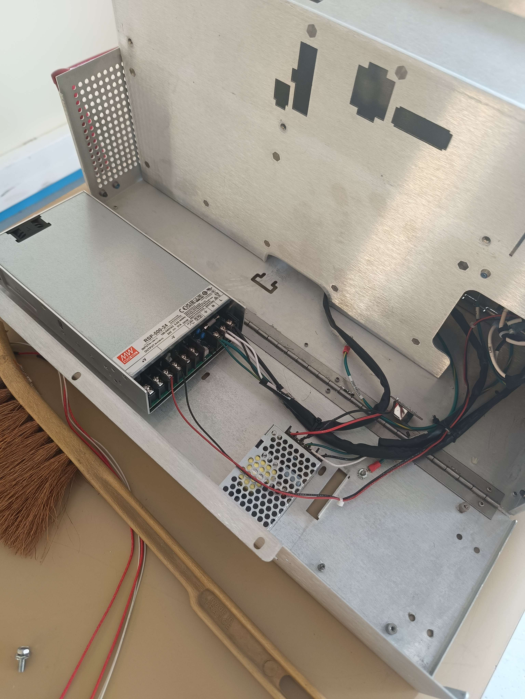
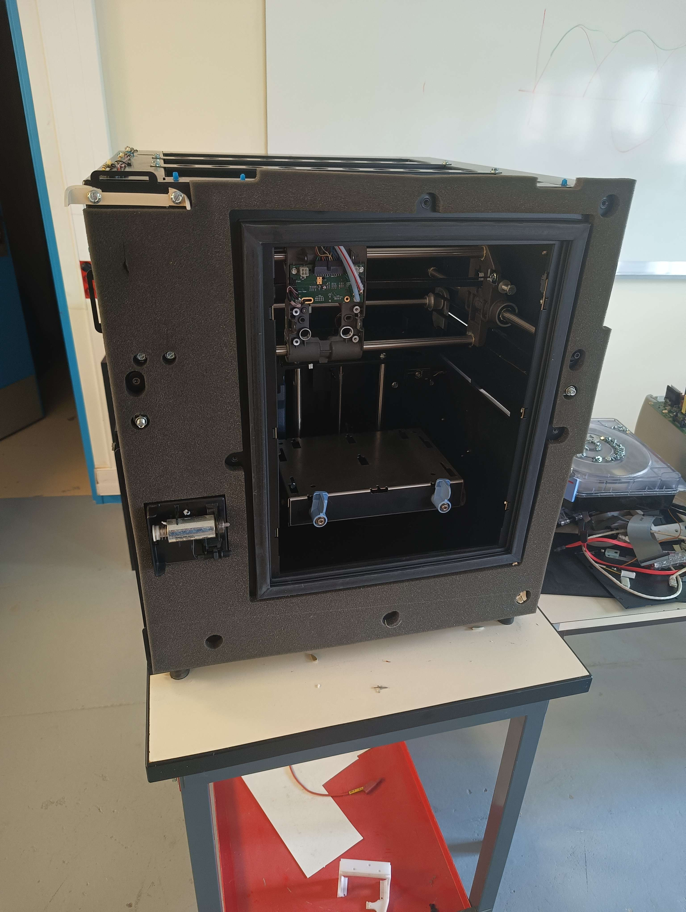
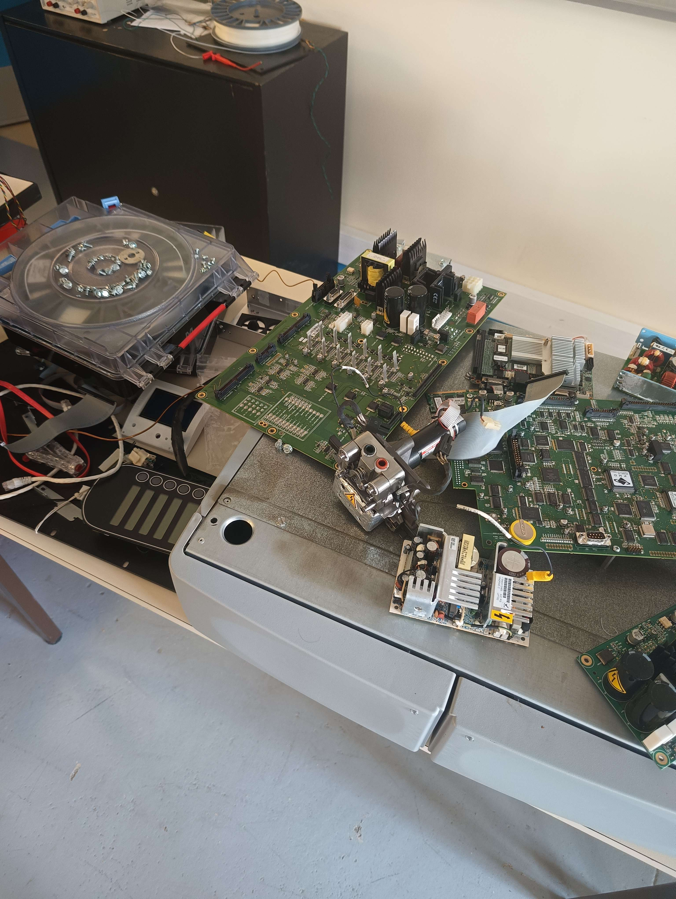

# 🚀 Upgrade 3D Printer with Klipper

> **Project completed during a class to upgrade a UPrint SE 3D printer using a Raspberry Pi 5 and Klipper firmware.**

---

## 🛠️ Project Description (ENGLISH)

### 🎯 Objective

The goal of this project is to modernize the 3D printer by:

- 🔄 Replacing the original electronics with a **Raspberry Pi 5**.
- ⚡ Installing the **Klipper** firmware for better speed, precision, and control.
- 🔌 Adding **two separate power supplies**:
  - One dedicated to the **Raspberry Pi**.
  - One dedicated to the **printer components**.

These modifications improve:
- ✅ Power management
- ✅ System stability
- ✅ Upgrade possibilities for the future

---

## 📷 Project Images

### 🔧 Power supply installation

### 🧹 Old electronics removed

### 🏗️ Printer frame ready for upgrades

---

# 🇫🇷 Description du projet (FRANÇAIS)

> **Projet réalisé dans le cadre d'un cours pour moderniser une imprimante 3D UPrint SE en utilisant une Raspberry Pi 5 et le firmware Klipper.**

---

## 🛠️ Objectif

L'objectif de ce projet est de moderniser l'imprimante en :

- 🔄 Remplaçant l'électronique d'origine par une **Raspberry Pi 5**.
- ⚡ Installant le firmware **Klipper** pour obtenir de meilleures vitesses, précisions et contrôles.
- 🔌 Ajoutant **deux alimentations séparées** :
  - Une alimentation dédiée à la **Raspberry Pi**.
  - Une autre pour les **composants de l'imprimante**.

Ces modifications permettent :
- ✅ Une meilleure gestion de l'alimentation
- ✅ Une meilleure stabilité du système
- ✅ Une préparation pour des évolutions futures

---
